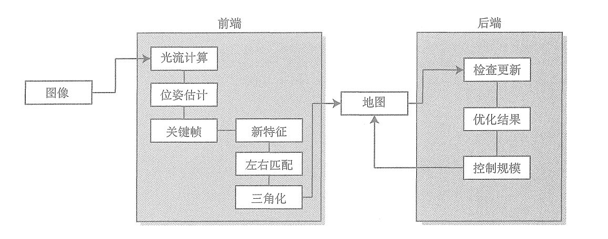

#13.2 工程框架
确定核心算法结构
- 处理的最基本单元是图像，在双目视觉中就是一对图像，一般称为一帧；
- 对帧提取特征，这些特征是很多2D的点
- 在图像之间寻找特征的关联，能多次看到某个特征，则使用三角化方法计算3D位置，即为路标。
这三者为基本的数据结构。

程序还拥有两个重要的模块：
- 前端。往前端插入图像帧，前端负责提取图像中的特征，然后与上一帧进行光流追踪，经过光流结果计算该帧的定位。必要时应该补充新的特征点做三角化，前端处理的结果将作为后端优化的初始值。
- 后端。后端是一个较慢的线程，它拿到处理后的关键帧和路标点，对它们进行优化，然后返回优化结果，后端控制优化问题的规模在一定范围之内，不会随时间一直增加。

#13.3 实现
##13.3.1 实现基本数据结构
基本数据结构的为帧、特征和路标点
- Frame 含有id、位姿、图像以及左右图像中的特征点，其中，Pose会被前后端同时设置或访问，因此会定义额Set和Get函数，并在函数内加锁；
- Feature 最主要的信息为自身的2D位置，此外还包含异常位的标志位，是否在左侧相册提取的标志位，可以通过一个Feature对象访问持有它的Frame以及所对应的路标。
- MapPoint 最主要的信息为其3D位置，以及记录其被哪些Feature观察
同时需要一个map类，地图以散列形式记录所有的关键帧和对应的路标点，同时维护一个被激活的关键帧和地图点，激活的概念即为窗口。
##13.3.2 前端
1.前端存在初始化、正常追踪、追踪丢失三种状态；
2.初始化状态中，根据左右目的光流匹配，寻找可以三角化的地图点，成功时建立初始地图；
3.追踪阶段，计算上一帧的特征点到当前帧的光流匹配，根据光流结果计算图像位姿，该计算只使用左目图像，不使用右目；
4.如果追踪的点较少，就判定当前帧为关键帧，对于关键帧：
- 提取新的特征点
- 找到这些特征点在右图的对应点，用三角化建立新的路标点
- 将新的关键帧和路标点加入地图，并触发一次后端优化

5.如果追踪丢失，则重置前端系统，重新初始化
##13.3.3 后端
后端在启动之后，将等待map_update_的条件变量。当地图更新被触发时，从地图中拿取激活的关键帧和地图点，执行优化
